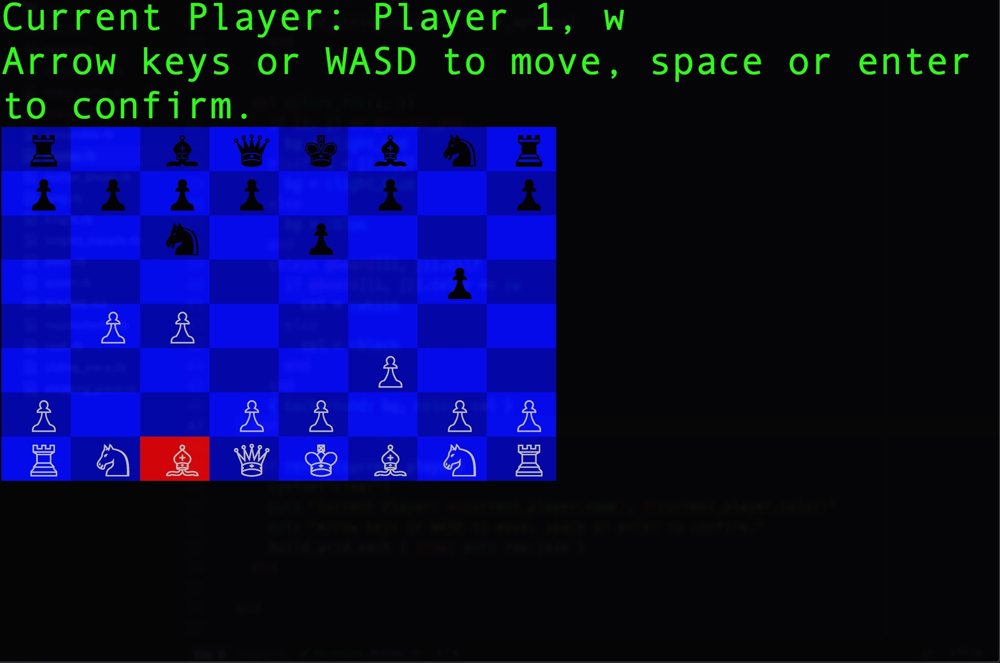

# Ruby Chess

This chess game can be played by cloning this repo to the directory of your choice and running 'ruby chess_game.rb' in your terminal.  Go head to head with a friend in this modern recreation of the classic strategy game!

#!/bin/sh

git filter-branch --env-filter '
OLD_EMAIL="pmckelvy1@gmail.com"
CORRECT_NAME="Patrick McKelvy"
CORRECT_EMAIL="pmckelvy1@gmail.com"
    export GIT_COMMITTER_NAME="$CORRECT_NAME"
    export GIT_COMMITTER_EMAIL="$CORRECT_EMAIL"
    export GIT_AUTHOR_NAME="$CORRECT_NAME"
    export GIT_AUTHOR_EMAIL="$CORRECT_EMAIL"
' --tag-name-filter cat -- --branches --tags
